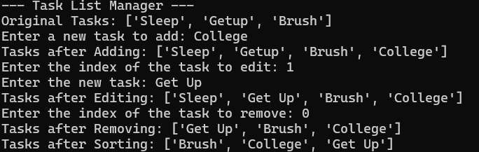

# AIM: Develop a Python program to manage a task list using lists and tuples, including adding, removing, updating, and sorting tasks.


**Input:** 
```
Enter a new task to add: College
Enter the index of the task to edit: 1
Enter the new task: Get Up
Enter the index of the task to remove: 1
```

**Expected Output:**
```
Original Tasks: ['Sleep', 'Getup', 'Brush']
Tasks after Adding: ['Sleep', 'Getup', 'Brush', 'College']
Tasks after Editing: ['Sleep', 'Get Up', 'Brush', 'College']
Tasks after Removing: ['Get Up', 'Brush', 'College']
Tasks after Sorting: ['Brush', 'College', 'Get Up']
```

**Sample Output:**


